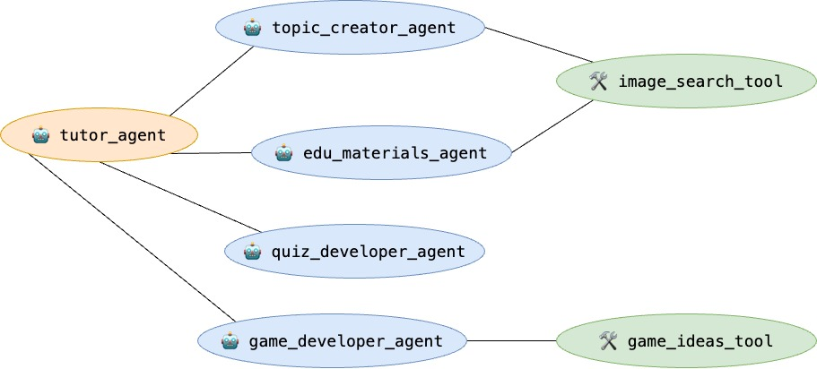

# Learnie 🧑‍🏫
**Vibe learning AI agent**

## Architecture



### Installation

Create & Activate Virtual Environment (Recommended):

```
python -m venv .venv
```

Install ADK:

```shell
pip install google-adk
```

### Run Web UI

```shell
adk web
```

### Run API Server

```shell
adk api_server
```

### Deployment

```shell
python3 deployment/deploy.py --create
```